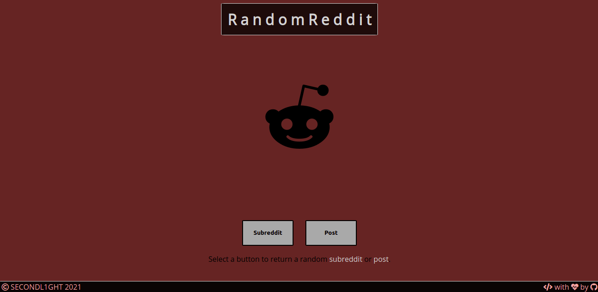

# RANDOM REDDIT

This is a straightforward React web app that users can return a random subreddit or post by clicking on buttons.

Link to site: <https://www.randomreddit.ninja>

## Table of Contents

-   [General Info](#general-information)
-   [Technologies Used](#technologies-used)
-   [Features](#features)
-   [Screenshots](#screenshots)
-   [Usage](#usage)
-   [Project Status](#project-status)
-   [Deployment Status](#deployment-status)
-   [Room for Improvement](#room-for-improvement)
-   [Acknowledgements](#acknowledgements)
-   [Contact](#contact)

## General Information

This website was created as my first React web app to practice and to display as part of my portfolio. It is a fun website that users can enjoy if they want a simple interactive experience and help with finding content on Reddit that they may be interested in.

## Technologies Used

-   HTML
-   CSS
-   JavaScript
-   React
-   Markdown

## Features

-   Find a random subreddit
-   Find a random Reddit post

## Screenshots

## Usage

Simply click on a button to receive results back.

## Project Status

Project is: _in progress_

The web app is live but I will continue to make improvements in the future.

## Deployment Status

## Room for Improvement

-   Display more information from each response

## Acknowledgements

-   Fonts by Google Fonts
-   Icons by (<https://www.fontawesome.com>)
-   Coded using Atom text editor
-   Special thanks to <https://github.com/alejandro> for reviewing my code and helping me refactor parts of it, also helping with debugging and overall being awesome!

## Contact

If you would like to contact me please send me a message on Discord @secondl1ght#9164 or by e-mail at secondl1ght@protonmail.com, I would love to hear from you!

Personal portfolio website: <https://www.secondl1ght.site>
